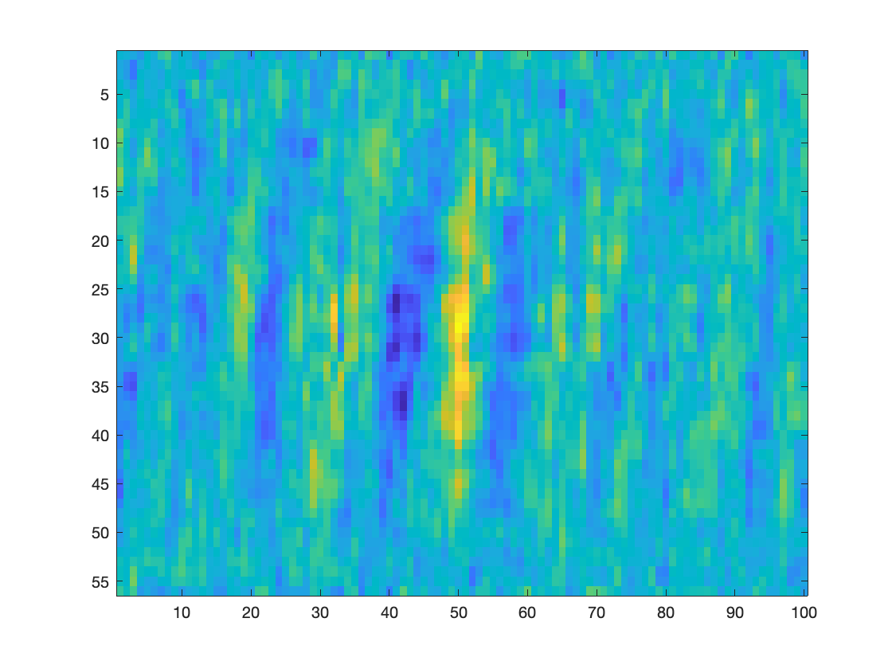

# ECE496
Data comes from https://borealisdata.ca/dataset.xhtml?persistentId=doi:10.5683/SP3/JRZDDR

We generated the following images using the matlab script process_file.m which borrows from some functions provided with the data as well as follows the general procedure to process the data

Here are our old images

This was done by running the following commands: 

clear
read_Intan_RHD2000_file
scaled_shiftd = ((amplifier_data / 10) + 0.5)*300;
image(scaled_shiftd(:,300:400),'CDataMapping','direct')
scaled_shiftd = ((amplifier_data / 100) + 0.5)*300;
image(scaled_shiftd(:,300:400),'CDataMapping','direct')

New Images

Generated by running the script and then selecting which data file to use and what spike to generate an image for. 