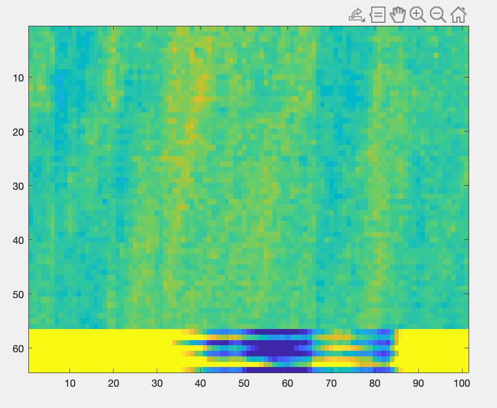
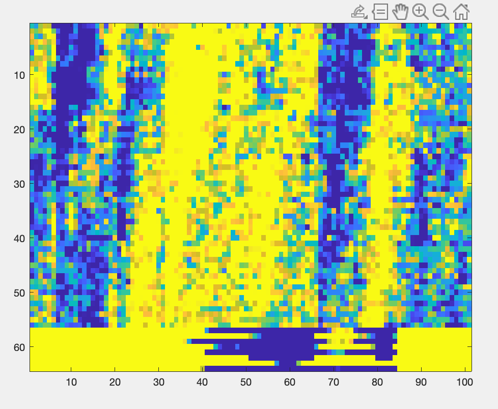

# ECE496
Data comes from https://borealisdata.ca/dataset.xhtml?persistentId=doi:10.5683/SP3/JRZDDR

We generated the following images using data set dorsi_17508_114643.rhd

This was done by running the following commands: 
>> clear
>> read_Intan_RHD2000_file
>> scaled_shiftd = ((amplifier_data / 10) + 0.5)*300;
>> image(scaled_shiftd(:,300:400),'CDataMapping','direct')
>> scaled_shiftd = ((amplifier_data / 100) + 0.5)*300;
>> image(scaled_shiftd(:,300:400),'CDataMapping','direct')